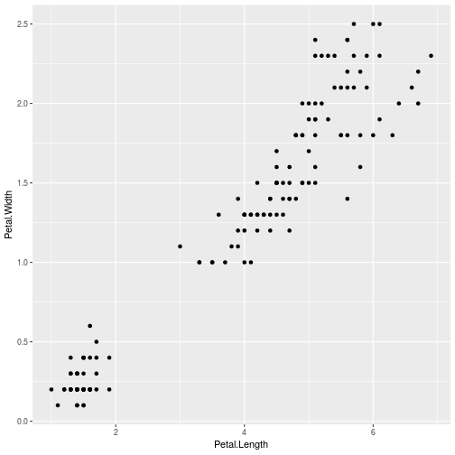
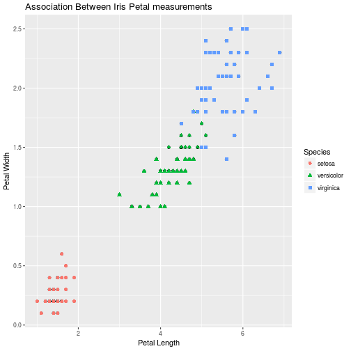
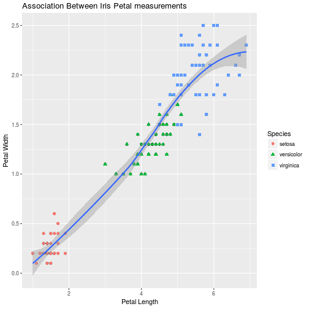
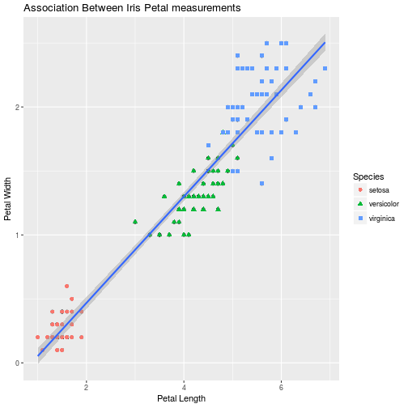
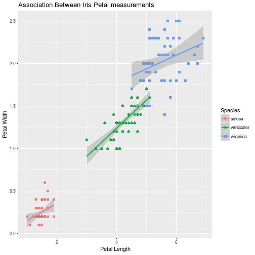

# Data Visualization with ggplot2

Visualizing  data is an area where R really shines.  For this we will split our focus between base and an installed package, `ggplot2`.  I will show some quick and easy graphics that we can produce with base R, but we won't spend anytime customizing them. Instead, we will move on quickly to `ggplot2`, which is now (I have no data to back this up), the de-facto standard for visualizing data in R.  Given that `ggplot2` is general package for creating essentially ALL types of visualizations, it can seem quite complex (and it is).  What I hope you will get out of this section is a basic understanding of how to create a figure and, most importantly, how to find help and examples that you can build off of for your own visualizations.

## Lesson Outline
- [Examples of greatness](#examples-of-greatness)
- [Basics of `ggplot2`](#basics-of-ggplot2)
- [Example explained](#example-explained)

## Exercise
- [Exercise 4.1](#exercise-41)

## Examples of greatness
Before we get started, I do like to show what is possible.  A couple of geospatial examples of maps created in R.

A few (now somewhat dated) examples of maps built with R show this:


And some fairly complicated figures:


And some cool examples using `ggplot2` with `plotly`.

<http://blog.revolutionanalytics.com/2014/11/3-d-plots-with-plotly.html>

Lastly, so that you know that there are many (often cool) mistakes that lead up to a final visualization there is [Accidental aRt](http://accidental-art.tumblr.com/).  And for a specific example ...

This final figure from [Hollister et al. 2017](http://onlinelibrary.wiley.com/enhanced/figures/doi/10.1002/ecs2.1321#figure-viewer-ecs21321-fig-0011) had as one of its early iterations this ["psychadelic doughnut"](http://accidental-art.tumblr.com/post/96720455195/was-trying-to-mess-with-projections-in-ggplot)

(**ht to Anne Kuhn, my office mate, for the name**)

Now that we are sufficiently motivated, lets take a step back to the very basics.

A few other great links that I have recently found are also useful for inspiration.  First, is a repository on GitHub that has most (all?) of the currently available color palletes in R: <https://github.com/EmilHvitfeldt/r-color-palettes>.  Second, the [R graph gallery](https://www.r-graph-gallery.com/) is a fantastic resource for seeing all that is possible for visualization in R and the code on how to do it!!

## Introduction to `ggplot2`: scatterplot
When you first get a dataset and are just starting to explore it, you want do be able to quickly visualize different bits and pieces about the data.  I tend to do this, initially, with base R. But since our time is short, we are going to focus our efforts just on `ggplot2` which is very powerful and widely used data visualization package and what I always use when I develop my final plots.

A lot has been written and discussed about `ggplot2`.  In particular see [here](http://ggplot2.org/), [here](http://docs.ggplot2.org/current/) and [here](https://github.com/karthikram/ggplot-lecture).  The gist of all this, is that `ggplot2` is an implementation of something known as the "grammar of graphics."  This separates the basic components of a graphic into distinct parts (e.g. like the parts of speech in a sentence).  You add these parts together and get a figure.

Before we start developing some graphics, we need to do a bit of package maintenance as `ggplot2` is not installed by default.


```r
install.packages("ggplot2")
library("ggplot2")
```

First thing we need to do is to create our ggplot object.  Everything we do will build off of this object.  The bare minimum for this is the data (handily, `ggplot()` is expecting a data frame) and `aes()`, or the aesthetics layers.  Oddly (at least to me), this is the main place you specify your x and y data values.


```r
# aes() are the "aesthetics" info.  When you simply add the x and y
# that can seem a bit of a confusing term.  You also use aes() to 
# change color, shape, size etc. of some items 
iris_gg <- ggplot(iris,aes(x=Petal.Length,y=Petal.Width))
```

Great, nothing happened...  All we did at this point is create an object that contains our data and what we want on the x and y axes.  We haven't said anything about what type of plot we want to make.  That comes next with the use of geometries or `geom_`'s.  

So if we want to simply plot points we can add that geometry to the ggplot object.  

A side note on syntax.  You will notice that we add new "things" to a ggplot object by adding new functions.  In concept this is very similar to the piping we talked about earlier.  Essentially it takes the output from the first function as the input to the second.  So to add points and create the plot, we would do:


```r
#Different syntax than you are used to
iris_gg + 
  geom_point()
```




```r
#This too can be saved to an object
iris_scatter <- iris_gg +
                geom_point()

#Call it to show the plot
iris_scatter
```


Not appreciably better than base, in my opinion.  But what if we want to add some stuff...

First a title and some axes labels.  These are part of `labs()`.


```r
#Getting fancy to show italics and greek symbols
iris_scatter <- iris_scatter +
                labs(title="Association Between Iris Petal measurements",
                     x="Petal Length", y="Petal Width")
iris_scatter
```


Now to add some colors, shapes etc to the point.  Look at the `geom_point()` documentation for this.


```r
iris_scatter <-  iris_scatter +
                geom_point(aes(color=Species, shape=Species),size=2)
iris_scatter
```



You'll notice we used `aes()` again, but this time inside of the geometry.  This tells ggplot2 that this aes only applies to the points.  Other geometries will not be affected by this.

In short, this is much easier than using base.  Now `ggplot2` really shines when you want to add stats (regression lines, intervals, etc.). 

Lets add a loess line with 95% confidence intervals


```r
iris_scatter_loess <- iris_scatter +
                geom_smooth(method = "loess")
iris_scatter_loess
```



Try that in `base` with so little code!

Or we could add a simple linear regression line with:


```r
iris_scatter_lm <- iris_scatter +
                  geom_smooth(method="lm")
iris_scatter_lm
```



And if we are interested in the regressions by group we could do it this way.


```r
iris_scatter_lm_group <- iris_scatter +
                        geom_smooth(method="lm", 
                                    aes(group=Species))
iris_scatter_lm_group
```


Or, if we wanted our regression lines to match the color.


```r
iris_scatter_lm_color <- iris_scatter +
                        geom_smooth(method="lm", 
                                    aes(color=Species))
iris_scatter_lm_color
```



Notice, that we specified the `aes()` again, but for `geom_smooth()`.  We only specified the x and y in the original `ggplot` object, so if want to do something different in the subsequent functions we need to overwrite it for the function in which we want a different mapping (i.e. groups).

In short, some of the initial setup for ggplot is a bit more verbose than base R, but when we want to do some more complex plots it is much easier in `ggplot2`.  

Before we get into another exercise, lets look at some of the other geometries.  In particular, boxplots and histograms.  If you want to see all that you can do, take a look at the list of `ggplot2` [geom functions](http://docs.ggplot2.org/current/).

## Example explained
Now that we have the basics of `ggplot2` down, let's take a closer look at our examples in `narrabay_analysis.R`.  As we review this we will cover the fact that plotting is 90% data prep, 9% tweaking, and 1% actual plotting code.  We will see examples of the functions we talked about above, and use a cool trick to turn our nice `ggplot2` plot into an interactive plot!  

## Excercise 4.1
For this exercise we will edit our code to produce the same plot that we have for the time series, but we now want the color of the dots to be represent the location.  Work together with the person next to you on this for about 15 minutes.  We will then finish it up together.
