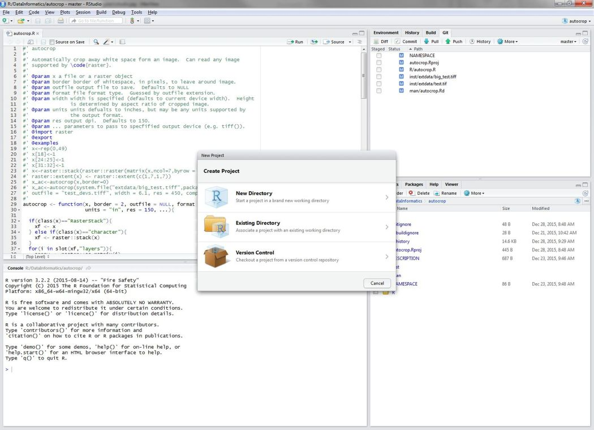
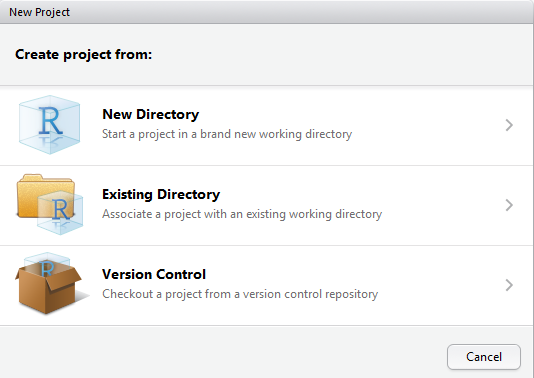
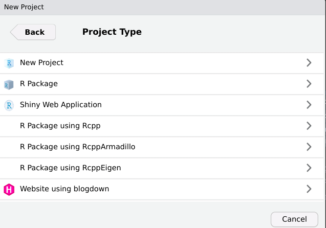
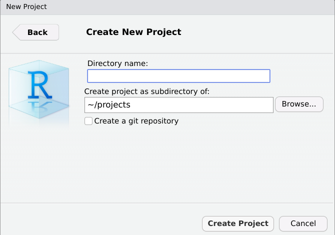
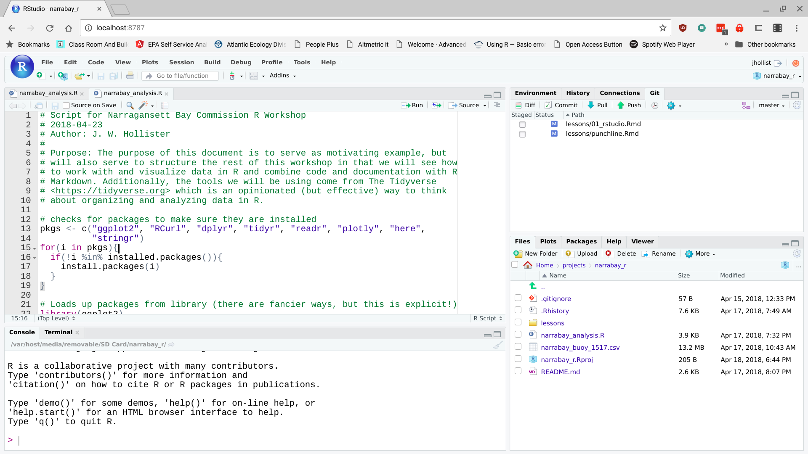
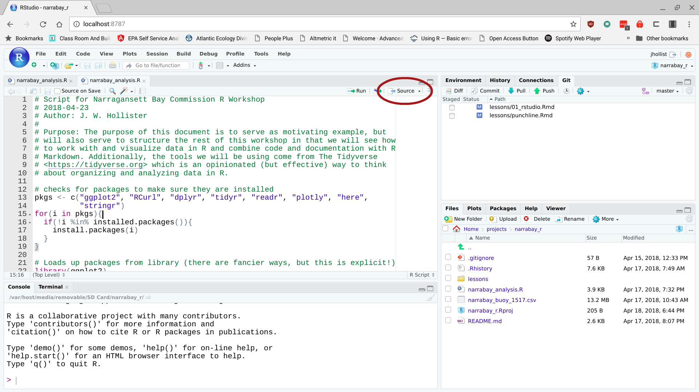

# The Punch Line First

For this workshop we are starting at the end and working backwards.  As such this first lesson is going to be in a follow the leader mode.  This is a useful way to teach this as we get to see what is possible early on and then we can focus on the details of how we get there.  Also, you will have a working example of an R script that includes a full data analysis.  Let's get started:

## Create a new project in RStudio

We need to create a new project.  In RStudio you need to find the New Project menu.

Then select "New Directory"

The select "New Project"

Then name your project, "narrabay_r_workshop"

## Open up the R Markdown Document

We need to download a copy of the script so that we can work with it.  Right click on this link ([narrabay_analysis.R](https://raw.githubusercontent.com/jhollist/narrabay_r/master/narrabay_analysis.R)) and select "save as" and browse to the RStudio Project (remember it is just a folder on your file system!).  

Once this is downloaded, in RStudio choose File:Open File (or ctrl-o for you keyboard folks).  Your screen should now look something like:

## Now run it!

We can now run the whole thing with the push of a button.  Find the "Source" button, stand back, and press it!

